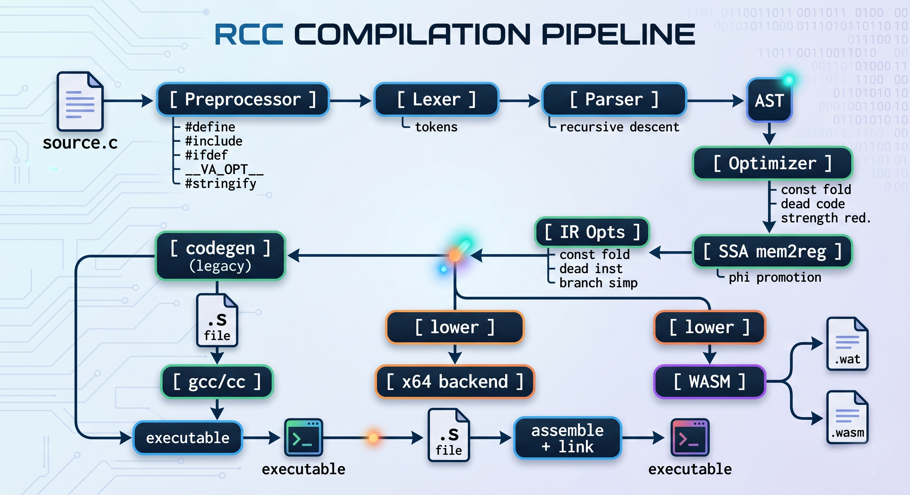

<p align="center">
  
</p>

<h3 align="center">A C11 compiler written in Rust with SSA IR, 3 backends, LSP server, and 11 optimizations.</h3>

[](https://github.com/bauratynov/rcc/actions)
[](LICENSE-MIT)
[]()
[]()
[-success)]()

```
$ rcc hello.c && ./hello
Hello from rcc!
```

## Why rcc?

|  | gcc | chibicc | other-cc | **rcc** |
|--|-----|---------|-----------|---------|
| LOC | 15M+ | 9K | 50K | **8.7K** |
| SSA IR | Yes | No | Yes | **Yes** |
| Backends | 20+ | 1 | 4 | **3** |
| Optimizations | 200+ | 0 | SSA | **11** |
| LSP Server | No | No | No | **Yes** |
| Linter | No | No | No | **Yes** |
| WASM Output | No | No | No | **Yes** |
| Error Quality | Good | Basic | Basic | **Rust-style** |
| Dependencies | Many | 0 | 0 | **0** |
| chibicc tests | N/A | 41/41 | N/A | **41/41** |

## Error Messages

**gcc:**
```
test.c:3:5: error: 'retrun' undeclared (first use in this function)
```

**rcc:**
```
error: unknown identifier 'retrun'
  --> test.c:3:5
  |
3 |     retrun x;
  |     ^^^^^^
  |
  = help: did you mean 'return'?
```

## Architecture

<p align="center">
  
</p>

## Quick Start

```bash
# Build
cargo build --release

# Compile C to native executable
./target/release/rcc hello.c

# Emit assembly
./target/release/rcc hello.c -S

# Compile to WebAssembly
./target/release/rcc hello.c --wasm        # .wat text
./target/release/rcc hello.c --wasm-bin    # .wasm binary

# Start LSP server (VS Code integration)
./target/release/rcc --lsp

# Run linter
./target/release/rcc hello.c --lint

# Dump IR
./target/release/rcc hello.c --ir

# Benchmark compilation speed
./target/release/rcc --bench hello.c
```

## Features

### Language Support (~93% C11)
- **Types**: `int`, `char`, `short`, `long`, `float`, `double`, `void`, `_Bool`, `unsigned`, `signed`
- **Compound types**: `struct`, `union`, `enum`, `typedef`, anonymous members, bitfields
- **Pointers & Arrays**: arithmetic scaling, VLA (parse), designated initializers
- **Control flow**: `if/else`, `while`, `do-while`, `for`, `switch/case/default`, `break`, `continue`, `goto`, computed `goto *p`
- **Operators**: all arithmetic, bitwise, logical, comparison, assignment, compound, ternary `?:`, comma, `sizeof`, `_Alignof`, cast, `_Generic`
- **Functions**: definitions, declarations, calls (6+ args), recursion, function pointers, variadic (`...`)
- **Preprocessor**: `#define` (object + function + variadic + `__VA_OPT__`), `#include`, `#ifdef/#ifndef/#if/#elif`, `#` stringify, `##` paste, `__FILE__`, `__LINE__`
- **GCC extensions**: statement expressions `({...})`, labels-as-values `&&label`, case ranges, `__attribute__`, `__builtin_*`, `typeof`
- **Literals**: decimal, hex, octal, binary, float, hex float, wide char `L'x'`, string concatenation

### Tooling
- **3 backends**: x86-64 native (Windows + Linux + macOS), WebAssembly Text (.wat), WASM binary (.wasm)
- **SSA IR**: full mem2reg with cross-block promotion, loop variable support, phi infrastructure
- **11 optimizations**: constant folding (AST + IR), dead code/instruction elimination, strength reduction, branch simplification, peephole (self-move, push/pop, dead store, jump-to-next, trivial ops)
- **Register allocator**: linear scan with live ranges (safe vregs, callee-saved save/restore)
- **LSP server**: diagnostics, completion (keywords), hover (type info), go-to-definition
- **Linter**: unused variables, unreachable code detection
- **Error messages**: Rust-style colored output with source context, `^` pointers, "did you mean?" suggestions
- **Benchmark mode**: `--bench` measures compilation speed per file

### Compilation Speed
```
$ rcc --bench test_inputs/simple.c
  32us/file (13 lines)

$ rcc --bench test_real/cJSON/cJSON.c
  29.8ms/file (3206 lines, 84KB)
```

## Project Stats

| Metric | Value |
|--------|-------|
| Lines of Rust | 8,748 |
| Source modules | 20 |
| Dependencies | 0 |
| C std headers | 14 (stdio, stdlib, string, stdarg, ...) |
| chibicc compat | 41/41 test files compile (100%) |
| Adapted tests | 32 test suites passing |
| Assert tests | 288+ |
| Optimizations | 11 across 3 levels |
| Platforms | Windows, Linux, macOS |

## CLI Reference

```
Usage: rcc [options] <file.c>

Compilation:
  rcc file.c              Compile to executable (default)
  rcc file.c -o out       Compile to specified output
  rcc file.c -S           Emit assembly only
  rcc file.c -E           Preprocess only
  rcc file.c -c           Compile to object file

Backends:
  rcc file.c --wasm       Emit WebAssembly Text (.wat)
  rcc file.c --wasm-bin   Emit WASM binary (.wasm)
  rcc file.c --use-ir     Compile through SSA IR pipeline

Analysis:
  rcc file.c --lint       Run linter
  rcc file.c --dump-ast   Print AST
  rcc file.c --ir         Print SSA IR
  rcc file.c --explain    Show compilation steps

Tools:
  rcc --lsp               Start LSP server
  rcc --bench file.c      Benchmark compilation speed

Preprocessor:
  -DFOO=1                 Define macro
  -I./include             Add include path
```

## Building

```bash
# Prerequisites: Rust 1.70+ and a C compiler (gcc/cc)
cargo build --release

# Run tests
cargo test

# Run chibicc compatibility tests
for f in test_chibicc_orig/*.c; do
  ./target/release/rcc -I test_chibicc_orig -S "$f" -o /dev/null && echo "OK: $f"
done
```

## Contributing

See [CONTRIBUTING.md](CONTRIBUTING.md) for project structure, how to add features, and good first issues.

## License

Licensed under either of:
- [MIT License](LICENSE-MIT)
- [Apache License, Version 2.0](LICENSE-APACHE)

at your option.
